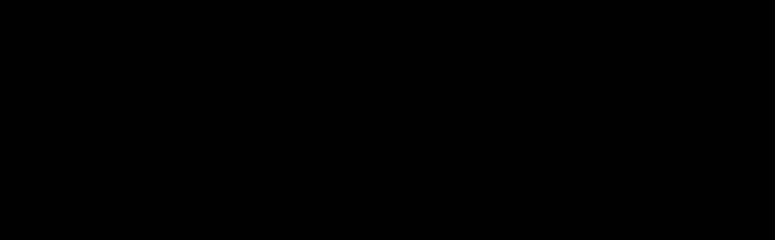

# CTF Task 16 — Darkness

## Task

> There is something lurking in the dark.

**Question:** What does the flag say?

## Investigation

The challenge provided a very dark PNG image:

```text
dark_1578020060816.png
```

At first glance, the image appeared to be almost completely black.



That immediately made me suspect that the information might not be visible in the normal RGB representation of the image.

Instead of treating the image as simply "black", I started looking for ways to inspect the individual components of the image.

## Looking Beyond the Visible Image

While researching image steganography, I came across **Stegsolve**.

Stegsolve is a tool designed for analyzing images by separating their color channels and individual bit planes.

This is useful because information can sometimes be hidden in a particular bit of the pixel data even when the normal image looks completely empty.

I found a guide explaining Stegsolve and used it to analyze the image's bit planes.


## Bit Plane Analysis

Instead of looking only at the normal image, I checked different bit planes and channel combinations.

The important idea here is that each pixel channel can be represented using individual bits.

For example, a single color channel contains:

```text
Bit 7  Bit 6  Bit 5  Bit 4  Bit 3  Bit 2  Bit 1  Bit 0
```

The lowest bit is commonly referred to as the **Least Significant Bit (LSB)**.

Steganography can use these bits to hide information without producing an obvious visual difference in the image.

By experimenting with the bit-plane settings in Stegsolve, hidden information started becoming visible.

## Extracting the Hidden Data

I used Stegsolve's extraction functionality and experimented with the available bit-plane and channel settings.

The hidden text appeared in the extraction preview:


The recovered text contained the flag:

```text
THM{7h3r3_15_h0p3_1n_7h3_d4rkn355}
```

## Flag

```text
THM{7h3r3_15_h0p3_1n_7h3_d4rkn355}
```

## What I Learned

This challenge introduced me to another important area of **image steganography**.

Previously, I mainly looked for information through:

- Metadata
- Strings
- File structure
- Embedded files
- Visible content

This challenge showed me that data can also be hidden at the **bit level** of an image.

I learned about:

- Stegsolve
- Bit-plane analysis
- RGB channels
- Least Significant Bits (LSB)
- Image-based steganography

The most important idea was that an image can look completely empty while still containing information inside its pixel data.

## Reflection

The biggest clue was actually the title:

> **"There is something lurking in the dark."**

The image looked almost completely black, but instead of assuming there was simply nothing there, I started considering whether the information was hidden somewhere that was not visible in the normal image.

The investigation changed from:

```text
"Where is the text in the image?"
```

to:

```text
"Which part of the image data contains the hidden information?"
```

That change in perspective led me to bit-plane analysis.

The solving process was:

```text
Dark image
    ↓
Suspect hidden data
    ↓
Research image steganography
    ↓
Find Stegsolve
    ↓
Analyze color channels / bit planes
    ↓
Extract hidden data
    ↓
Recover the flag
```

The main lesson from this challenge was:

> **If information is not visible at the surface, inspect the underlying representation.**
