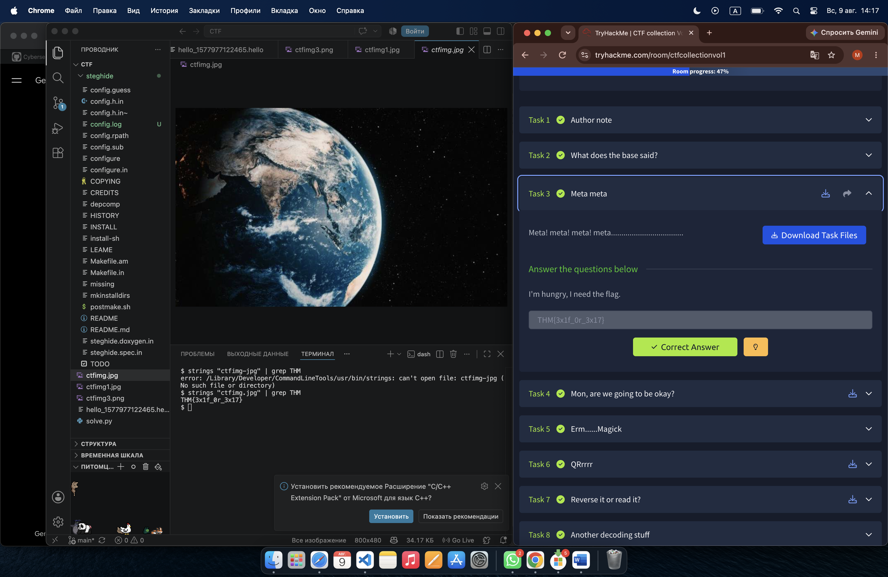

# CTF Task 3 — Hidden Data in an Image

## Task

> Meta! meta! meta! meta...................................

> I'm hungry, I need the flag.

**Task file:** `ctfimg.jpg`

## Objective

Find the hidden flag inside the image file.

## Investigation

This was my first CTF challenge involving an image file, and initially I had no idea how to approach it.

My first assumption was that the flag might be visually hidden somewhere inside the image. I inspected the image itself and considered the possibility that the flag could be written in very small text or hidden somewhere in the visible content.

I also tried to inspect the source code, but this did not make sense for the task because the target was a **JPG image file**, not a webpage.

At that point, I started researching how image files can be investigated from the command line.

This led me to the `strings` utility.

## Approach

The `strings` command searches a file for sequences of printable characters.

Since a JPG file is a binary file, most of its contents are not readable as normal text. However, a binary file can still contain readable strings.

I decided to search the image for the `THM` prefix used by TryHackMe flags.

I ran:

```bash
strings "ctfimg.jpg" | grep THM
```

The command immediately returned:

```text
THM{3x1f_0r_3x17}
```



## Why This Worked

The flag was stored as readable text inside the image file.

The command:

```bash
strings "ctfimg.jpg"
```

extracts printable character sequences from the binary file.

The pipe:

```text
|
```

passes that output to another command.

Then:

```bash
grep THM
```

filters the output and displays only lines containing `THM`.

So the complete workflow was:

```text
JPG image
    ↓
Treat the image as a file, not only as a visual object
    ↓
strings
    ↓
Search printable text
    ↓
grep THM
    ↓
Flag found
```

## Flag

```text
THM{3x1f_0r_3x17}
```

## What I Learned

This challenge changed the way I think about image files.

An image is not only something that can be viewed visually. It is also a file containing binary data, and that data can be investigated using command-line tools.

I also learned the practical use of:

```bash
strings
```

for extracting readable strings from binary files, and:

```bash
grep
```

for filtering command output.

## Reflection

My initial approach was focused entirely on what I could see in the image. The important realization was that a file can contain useful information that is not visible when the file is opened normally.

This challenge taught me to think about the **underlying data**, not only the visual representation of a file.

When analyzing an unfamiliar file, I should ask not only:

> "What do I see?"

but also:

> "What information is actually stored inside this file?"
