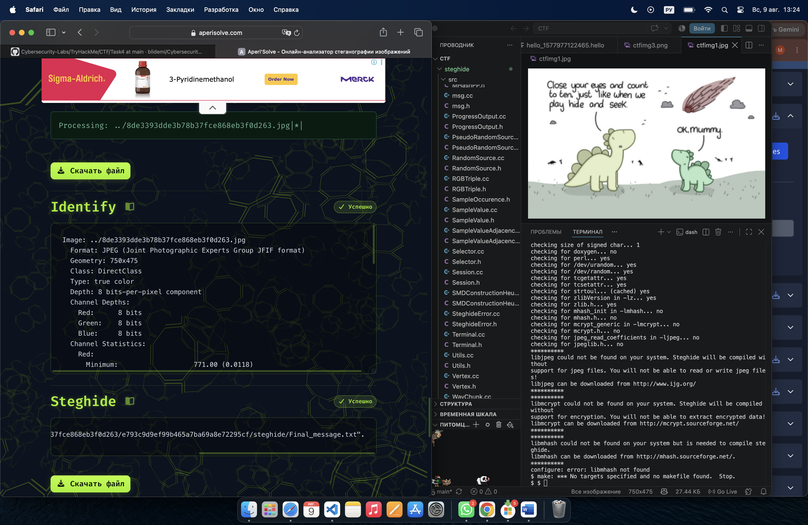
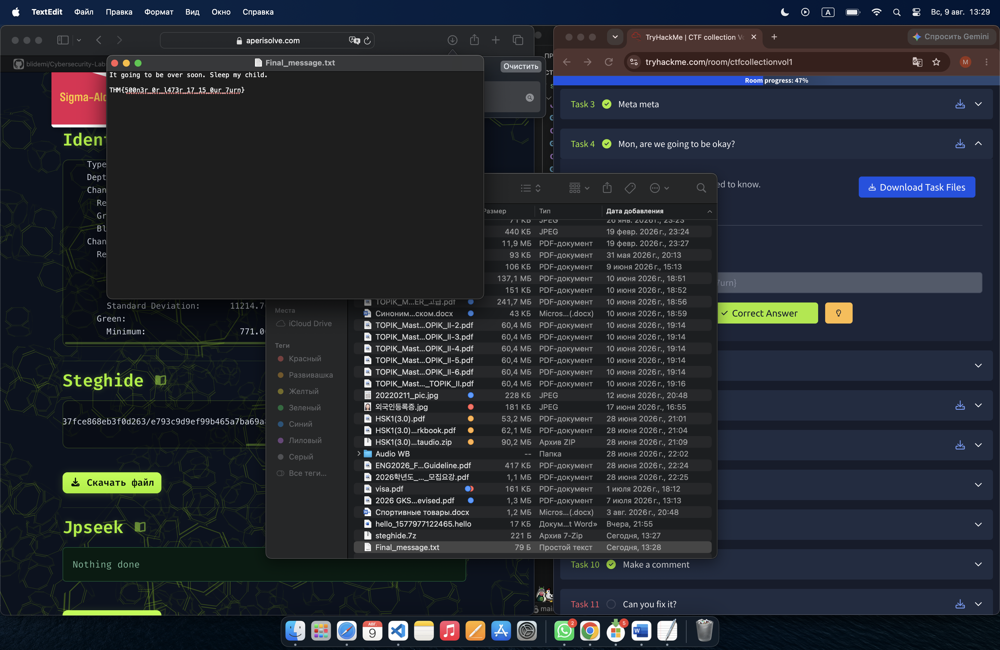

# CTF Task 4 — Image Steganography

## Task

> Something is hiding. That's all you need to know.

> It is sad. Feed me the flag.

**Task file:** `ctfimg1.jpg`

## Objective

Find the hidden flag inside the image.

## Investigation

This was my second challenge involving a flag hidden inside an image, but the approach that worked for the previous task did not work here.

At first, I did not know what technique was being used. While investigating the challenge, I learned about **steganography**.

Steganography is the practice of hiding information inside another file, such as an image, audio file, or video, without making the hidden information immediately visible.

Because the challenge specifically provided a JPEG image and said that something was hiding, I considered the possibility that additional data had been embedded inside the image.

## First Approach — Steghide

One of the tools I found for working with image steganography was **steghide**.

I first tried to extract hidden data with:

```bash
steghide extract -sf ctfimg1.jpg
```

However, `steghide` was not installed on my system.

I tried installing it with Homebrew:

```bash
brew install steghide
```

Homebrew returned:

```text
Warning: No available formula with the name "steghide".
Error: No formulae or casks found for steghide.
```

So the straightforward installation method was not available on my system.

## Second Approach — Building Steghide

Instead of immediately giving up, I tried to build the tool manually from a GitHub repository.

I installed several dependencies:

```bash
brew install zlib libjpeg mhash mcrypt
```

Then I cloned the repository:

```bash
git clone https://github.com/607011/steghide.git
cd steghide
./configure
make
```

I also tried the provided post-build script when the normal build process did not work:

```bash
./postmake.sh
```

However, this approach also did not lead to a working installation.

At this point, I decided that continuing to fight with the installation was not the most efficient way to solve the challenge. I wanted to understand the image and the steganography technique rather than spend all my time fixing the toolchain.

## Third Approach — Steganography Analysis Tool

While researching other ways to analyze the image, I discovered that there are specialized online tools for steganography analysis.

I used [Aperi'Solve](https://www.aperisolve.com/) to inspect the image.

I deliberately did not start with an online tool because I wanted to understand what was happening and try the command-line approach first.

The analysis produced a large amount of information about the image. Among the results, I noticed information related to **steghide**.



This confirmed that steghide-related data was present in the image and gave me another direction to investigate.

## Finding the Flag

The analysis provided a `steghide` output file.

After downloading and examining the extracted file, I found the flag:

```text
THM{500n3r_0r_l473r_17_15_0ur_7urn}
```



## Flag

```text
THM{500n3r_0r_l473r_17_15_0ur_7urn}
```

## What I Learned

This challenge introduced me to **image steganography** and showed me that information can be hidden inside an image without being visible during normal viewing.

I also learned an important practical lesson: a tool failing to install does not mean the investigation has to stop.

My initial plan was:

```text
Image
  ↓
Suspect steganography
  ↓
Use steghide
```

When that failed, I changed my approach:

```text
Failed tool installation
        ↓
Research alternative analysis methods
        ↓
Analyze the image with Aperi'Solve
        ↓
Identify steghide-related data
        ↓
Inspect the extracted result
        ↓
Find the flag
```

## Reflection

The most important part of this challenge for me was not simply finding the flag. It was learning how to continue an investigation when the first technical approach fails.

I initially focused too much on making `steghide` work. After realizing that I was spending more time troubleshooting the installation than analyzing the challenge itself, I changed direction and looked for another way to obtain useful information from the image.

This taught me that in cybersecurity, knowing a tool is useful, but knowing **when to switch tools and change your approach** is equally important.
