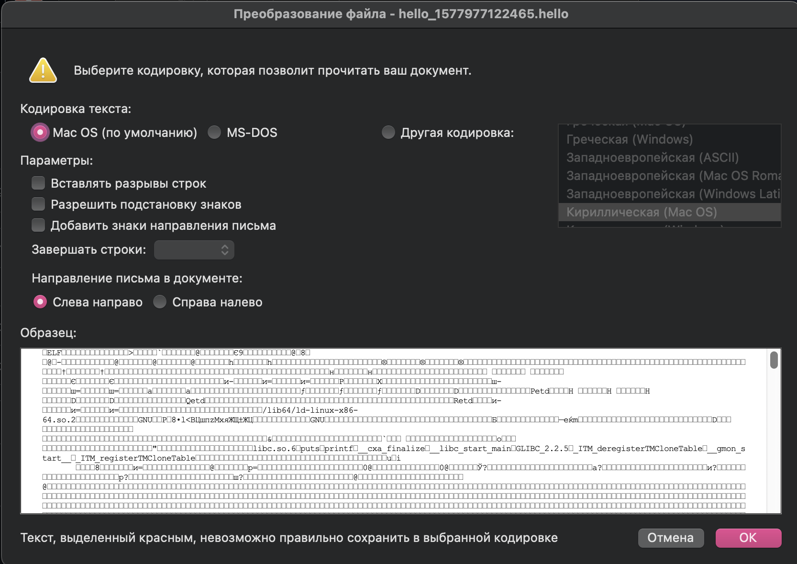
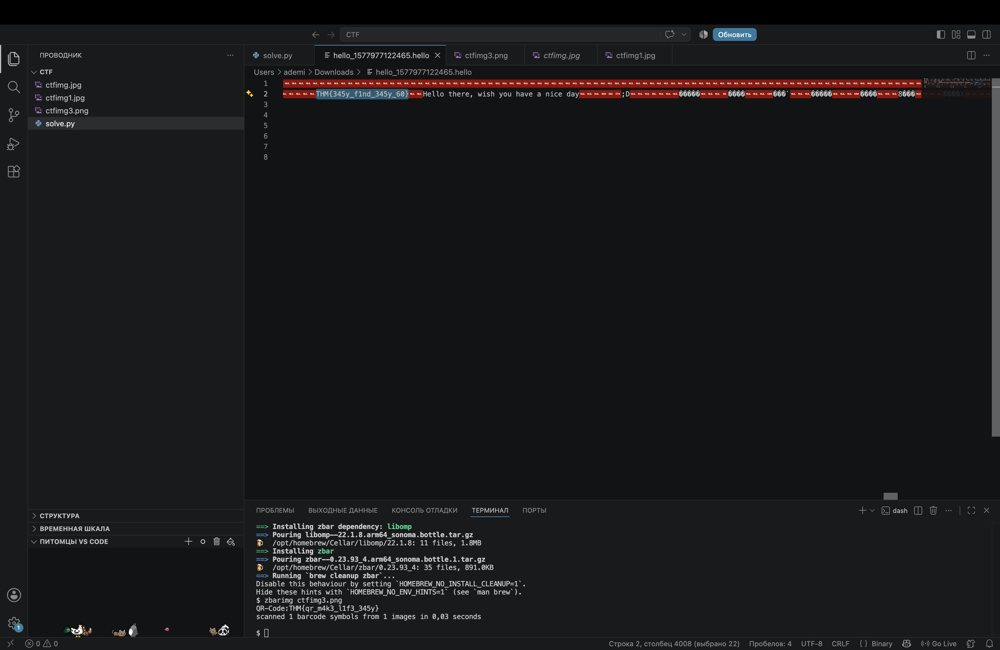

# CTF Task 7 — Hidden Flag in a Binary File

## Task

> Both works, it's all up to you.

**Task file:** `hello_1577977122465.hello`

## Goal

Find the hidden flag inside the provided file.

## Approach

As soon as I tried to open the file, I ran into a problem. The system identified it as a **binary file** and asked me which application should be used to open it and which encoding should be used.


I first tried opening it with a text editor, but I could not understand the contents. It was clearly not being displayed in a useful way, so I decided to try another approach.

I opened the file in **Visual Studio Code**. The file contained a large amount of strange characters and symbols that did not look like normal text.

One thing I noticed was that the content extended very far horizontally. I became curious about what might be hidden further to the right, so I started scrolling through the file.

At the same time, I was researching possible ways to analyze or decode this type of file.

While scrolling through the contents, I suddenly found the flag hidden inside the file.The file contained readable text embedded within its binary data.

It was a very unexpected discovery, especially because the file initially looked like meaningless binary data.

## Result

The flag was found directly inside the file contents:

```text
THM{345y_f1nd_345y_60}
```



## What I Learned

This challenge taught me not to immediately assume that strange or unreadable file contents need to be decoded.

Sometimes useful information can simply be hidden somewhere inside the file.

When a file does not open normally, it is worth trying different tools and editors and inspecting the raw contents instead of immediately giving up.

I also learned that **visual inspection and curiosity can be useful during CTFs**. In this case, simply scrolling through the file helped me discover the flag.
